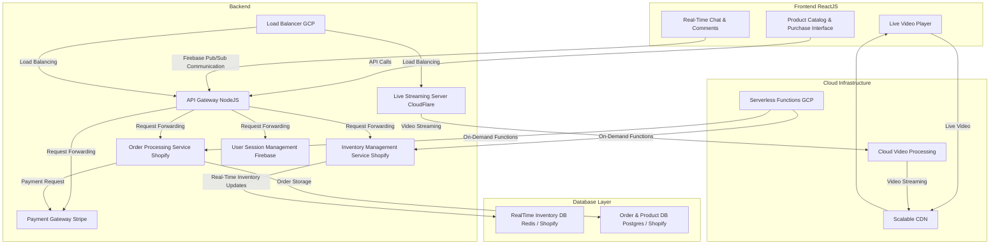

```mermaid
graph TD
    subgraph Frontend ReactJS
        A1[Live Video Player]
        A2[Product Catalog & Purchase Interface]
        A3[Real-Time Chat & Comments]
    end

    subgraph Backend
        B1[API Gateway NodeJS]
        B2[Inventory Management Service Shopify]
        B3[Order Processing Service Shopify]
        B4[User Session Management Firebase]
        B5[Live Streaming Server CloudFlare]
        B6[Load Balancer GCP]
        B7[Payment Gateway Stripe]
    end

    subgraph Database Layer
        D1[RealTime Inventory DB Redis / Shopify]
        D2[Order & Product DB Postgres / Shopify]
    end

    subgraph Cloud Infrastructure
        C1[Scalable CDN]
        C2[Cloud Video Processing ]
        C3[Serverless Functions GCP]
    end

    %% Define Interactions
    A1 -->|Live Video| C1
    A2 -->|API Calls| B1
    A3 -->|Firebase Pub/Sub Communication| B1

    B1 -->|Request Forwarding| B2
    B1 -->|Request Forwarding| B3
    B1 -->|Request Forwarding| B4
    B1 -->|Request Forwarding| B7

    B2 -->|Real-Time Inventory Updates| D1
    B3 -->|Order Storage| D2
    B3 -->|Payment Request| B7

    C2 -->|Video Streaming| C1
    C1 --> A1

    B5 -->|Video Streaming| C2
    B6 -->|Load Balancing| B1 & B5
    C3 -->|On-Demand Functions| B2 & B3
```